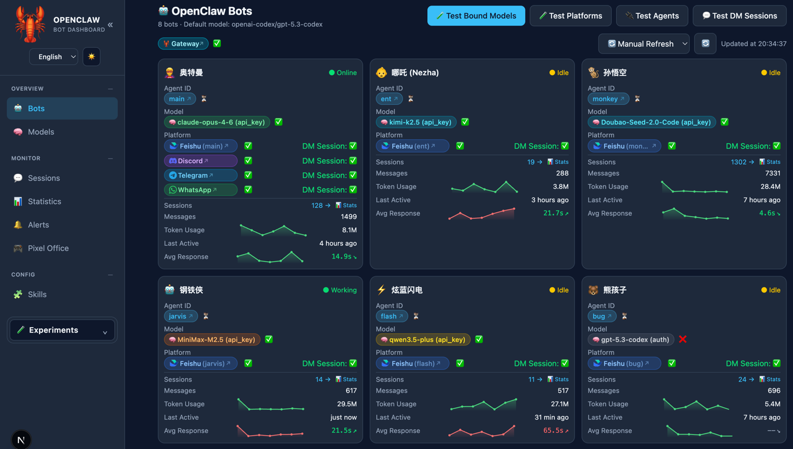
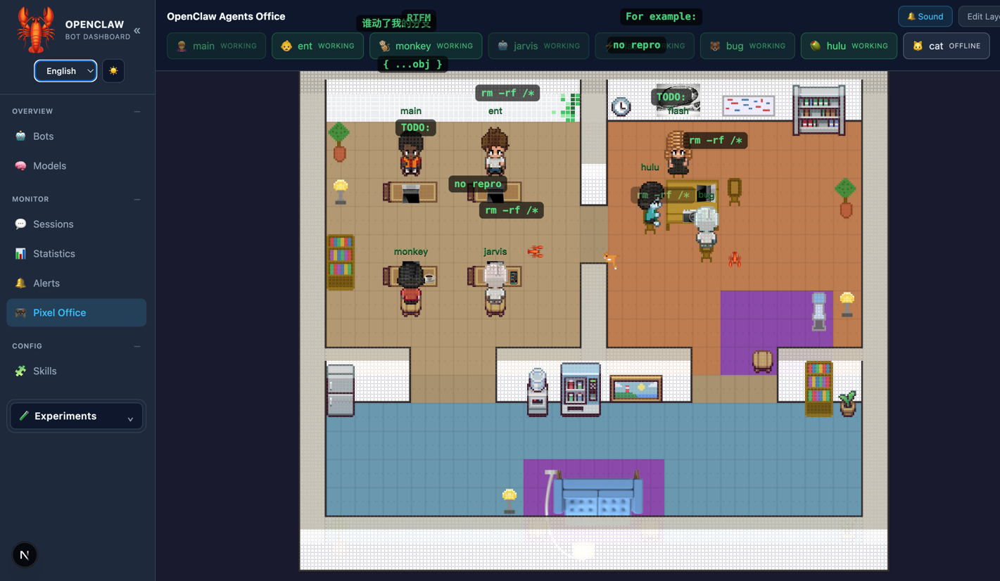
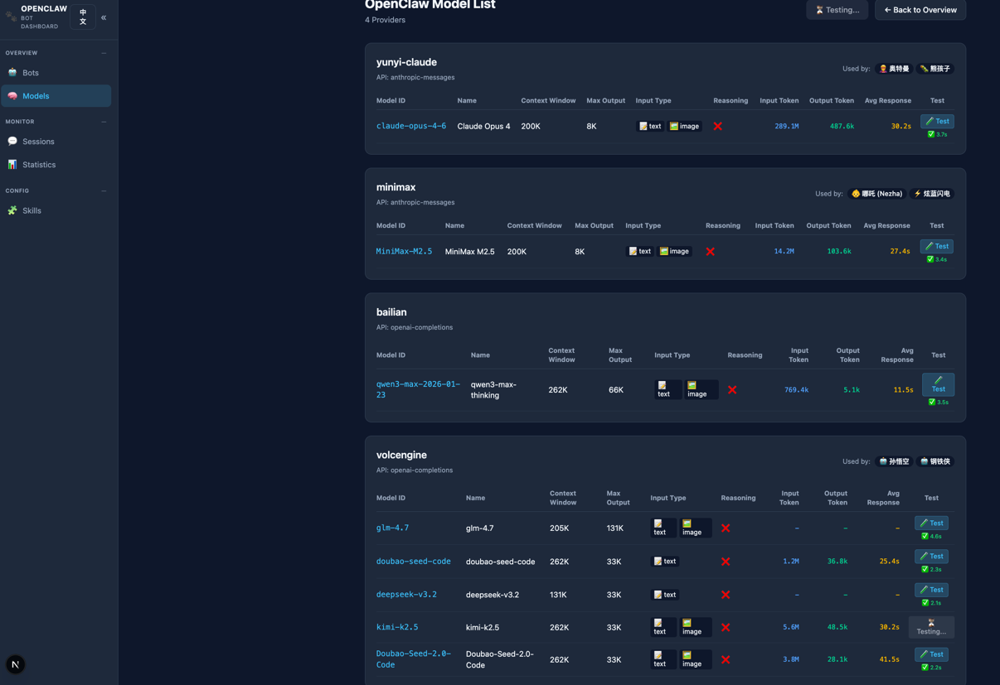

# OpenClaw Bot Review

一个基于 Next.js 的 OpenClaw 可视化与任务自动化平台，包含：

- Agent/模型/会话/告警可视化仪表盘
- 任务分配、自动调度、自动审查、飞书通知
- Pixel Office 可视化办公室




## 功能概览

### 仪表盘能力

- Agent 总览、会话管理、模型列表、消息统计
- Gateway 健康检测与平台连通测试
- 告警中心与技能列表

### 任务自动化能力

- 任务生命周期：`pending -> assigned/blocked -> in_progress -> submitted -> approved/rejected`
- 调度器（scheduler）自动执行 `assigned` 任务
- 审查器（reviewer）自动审查 `submitted` 任务
- Agent 忙碌时支持排队等待（wait for idle）
- 关键节点飞书通知

## 快速开始

### 1) 安装依赖

```bash
git clone https://github.com/xmanrui/OpenClaw-bot-review.git
cd OpenClaw-bot-review
npm install
```

### 2) 启动开发环境

```bash
npm run dev
```

访问：

- 仪表盘主页：`http://localhost:3000`
- 任务页面：`http://localhost:3000/tasks`
- Pixel Office：`http://localhost:3000/pixel-office`

## 常用命令

```bash
# 开发
npm run dev
npm run dev:turbo

# 构建与生产启动
npm run build
npm start

# 任务系统集成脚本（需本地服务已启动）
bash scripts/test-task-management.sh
bash scripts/test-full-automation.sh
```

## 任务系统最小闭环

```bash
# 启动调度器
curl -s -X POST "http://localhost:3000/api/task-scheduler" \
  -H "Content-Type: application/json" \
  -d '{"service":"scheduler","action":"start"}' | jq .

# 启动审查器
curl -s -X POST "http://localhost:3000/api/task-scheduler" \
  -H "Content-Type: application/json" \
  -d '{"service":"reviewer","action":"start"}' | jq .

# 创建并自动调度任务
curl -s -X POST "http://localhost:3000/api/tasks" \
  -H "Content-Type: application/json" \
  -d '{
    "title":"示例任务",
    "description":"请输出可执行结果",
    "assignedTo":"niuma-searcher",
    "autoDispatch":true
  }' | jq .
```

## 配置说明

### OpenClaw 配置目录

默认读取 `~/.openclaw`，可通过环境变量覆盖：

```bash
OPENCLAW_HOME=/opt/openclaw npm run dev
```

### 系统配置

任务调度、审查和飞书配置位于：

- `data/system-config.json`
- 示例文件：`data/system-config.example.json`

## 项目结构

```text
OpenClaw-bot-review/
├── app/                    # Next.js 页面与 API
├── lib/                    # 核心逻辑（调度、审查、通知、配置）
├── data/                   # 本地数据（任务、系统配置）
├── scripts/                # 集成测试与工具脚本
├── docs/                   # 项目文档
│   └── images/             # 文档图片资源
└── public/                 # 静态资源
```

## 文档入口

- 文档总览：[docs/README.md](docs/README.md)
- API 参考：[docs/API_REFERENCE.md](docs/API_REFERENCE.md)
- 任务生命周期：[docs/TASK_LIFECYCLE.md](docs/TASK_LIFECYCLE.md)
- 自动调度：[docs/TASK_AUTO_DISPATCH.md](docs/TASK_AUTO_DISPATCH.md)
- 自动审查：[docs/BOSS_AUTO_REVIEW.md](docs/BOSS_AUTO_REVIEW.md)
- Agent 等待机制：[docs/AGENT_IDLE_WAIT.md](docs/AGENT_IDLE_WAIT.md)
- 飞书通知：[docs/FEISHU_NOTIFICATIONS.md](docs/FEISHU_NOTIFICATIONS.md)

## 界面预览

### 仪表盘


### 模型页


### 会话页


### 像素办公室


## 许可证

MIT
